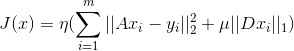

## Image Reconstruction by Splitting Deep Learning Regularization from Iterative Inversion

### Image Reconstruction problems
fast MRI
  - partial 2D Fourier transform
  
low dose CT
  - X-ray transform
  
### Idea
We do not intend to learn an end-to-end inversion mapping from the measurements to 
the reconstructed image as previous work.

data consistence is maintained through iteration for the reconstruction.

